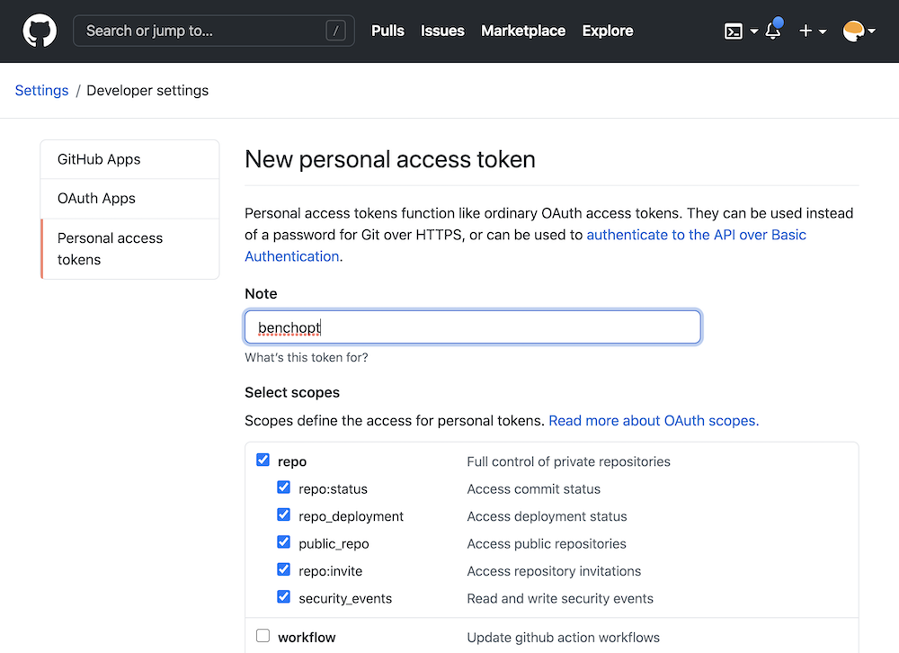

.. _manage_results:

Manage benchmark results
========================

.. _benchmark_results:

Description of the benchmark results DataFrame
-----------------------------------------------

Once the benchmark is run, the results are stored as a ``pd.DataFrame`` in a
``.parquet`` file, located in a directory ``./outputs`` in the benchmark
directory, with a ``.parquet`` file.
By default, the name of the file include the date and time of the run,
as ``benchopt_run_<date>_<time>.parquet`` but a custom name can be given using
the :option:`--output` option of ``benchopt run``.
The DataFrame contains the following columns:

- ``objective_name|solver_name|dataset_name``: the names of the different benchopt
  components used for this line.
- ``obj_description|solver_description``: A more verbose description of the
  objective and solver, displayed in the HTML page.
- ``file_objective|file_solver|file_dataset``: The filename of the objective,
  solver, and dataset used for this line.
- ``p_obj_{p}``: the value of the objective's parameter ``p``.
- ``p_solver_{p}``: the value of the solver's parameter ``p``.
- ``p_dataset_{p}``: the value of the dataset's parameter ``p``.
- ``time``: the time taken to run the solver until this point of the performance curve.
- ``stop_val``: the number of iterations or the tolerance reached by the solver.
- ``idx_rep``: If multiple repetitions are run for each solver with ``--n-rep``,
  this column contains the repetition number.
- ``sampling_strategy``: The sampling strategy used to generate the performance
  curve of this solver. This allow to adapt the plot in the HTML depending on
  each solver.
- ``objective_{k}``: The value associated to the key ``k`` in the
  ``Objective.evaluate_result`` dictionary.

The remaining columns are informations about the system used to run the
benchmark, with keys ``{'env_OMP_NUM_THREADS', 'platform', 'platform-architecture', 'platform-release', 'platform-version', 'system-cpus', 'system-processor', 'system-ram (GB)', 'version-cuda', 'version-numpy', 'version-scipy', 'benchmark-git-tag', 'run_date'}``.

.. _collect_results:

Collect benchmark results
-------------------------

The result file is produced only once the full benchmark has been run.
When the benchmark is run in parallel, the results that have already been
computed can be collected using the :option:`--collect` option with
``benchopt run``. Adding this option with the same command line will
produce a parquet file with all the results that have been computed so far.

.. _merge_results:

Merge results from multiple runs
--------------------------------

Multiple runs of the same benchmark can be merged together using the
``benchopt merge`` command. This allows to collect multiple runs, or to
aggregate results from different users. By default, the merged results contain
all lines from the different result files, with no additional processing.

The resulting file is stored in the benchmark directory with the name
``merged_results.parquet``. The name can be changed using the :option:`--output` option of the ``benchopt merge`` command.

It is also possible to specify the ``--keep`` option whether to only keep
``'all'`` lines, or to keep only the ``'last'`` line per ``objective_name``,
``solver_name``, ``dataset_name``, and ``idx_repetition``. In this case, only
the line from the most recent run will be kept for each evaluation.

Note that the run date is included in the result file in the ``run_date``
columm. If it is not present in the original result file, benchopt uses
the file creation date as a proxy for the run date. This allows to easily
identify the most recent line when using the ``--keep 'last'`` option.

Clean benchmark results
-----------------------

The results and cache of previously run benchmark can be cleaned using the
``benchopt clean`` command. This command will remove the ``./results`` and
``./__cache__`` directories in the benchmark directory.

.. _publish_benchmark:

Publish benchmark results
-------------------------

Benchopt allows you to publish your benchmark results with one command
``benchopt publish``. Results can be published to GitHub (default) or to a
`Hugging Face <https://huggingface.co/>`_ dataset repository, using the
``--hub`` option:

.. code-block::

    $ benchopt publish ./benchmark_logreg_l2 --hub github     # default
    $ benchopt publish ./benchmark_logreg_l2 --hub huggingface

Publish to GitHub
~~~~~~~~~~~~~~~~~

The default behaviour sends results to GitHub by opening a pull-request on
the `Benchopt results repository <https://github.com/benchopt/results>`_.
Once the pull-request is merged it will appear automatically on the
`Benchopt Benchmarks website <https://benchopt.github.io/results/>`_.

Workflow example:

.. code-block::

    $ git clone https://github.com/benchopt/benchmark_logreg_l2
    $ benchopt run ./benchmark_logreg_l2
    $ benchopt publish ./benchmark_logreg_l2 -t <GITHUB_TOKEN>

You see that to publish you need to specify the value of ``<GITHUB_TOKEN>``.
This GitHub access token contains 40 alphanumeric characters that allow GitHub
to identify you and use your account.
After getting your personal token as explained below the last
line will read something like:

.. code-block::

    $ benchopt publish ./benchmark_logreg_l2 -t 1gdgfej73i72if0852a685ejbhb1930ch496cda4

.. warning::

    Your GitHub access token is a sensitive information. Keep it
    secret as it is as powerful as your GitHub password!

Let's now see how to create your personal GitHub token.

Obtaining a GitHub token
^^^^^^^^^^^^^^^^^^^^^^^^

Visit `https://github.com/settings/tokens <https://github.com/settings/tokens>`_
and click on ``generate new token``.
Then create a token named benchopt, ticking the **repo** box as shown below:

Then click on ``generate token`` and copy this token of 40 characters in a
secure location. Note that the token can be stored in a config file for benchopt
using ``benchopt config set github_token <TOKEN>``. More info on config files can
be found in :ref:`config_benchopt`.

Publish to Hugging Face
~~~~~~~~~~~~~~~~~~~~~~~

Results can also be published to a `Hugging Face <https://huggingface.co/>`_
dataset repository. This is useful for sharing results privately or with a
specific team, without going through the Benchopt website.

When results are published to Hugging Face, they are merged with any existing
results already in the repository for the same benchmark. This allows multiple
users to contribute results to the same dataset. The ``--keep`` option controls
whether to keep ``'all'`` lines or only the ``'last'`` line per unique
configuration when merging (default: ``'last'``).

Workflow example:

.. code-block::

    $ git clone https://github.com/benchopt/benchmark_logreg_l2
    $ benchopt run ./benchmark_logreg_l2
    $ benchopt publish ./benchmark_logreg_l2 --hub huggingface \
        -t <HF_TOKEN> -R <HF_REPO_ID>

where ``<HF_REPO_ID>`` is the Hugging Face dataset repository identifier,
e.g. ``my-org/benchopt-results``. The repository is created automatically
if it does not exist. The HF token and repo can also be stored in a config
file for benchopt:

.. code-block::

    $ benchopt config set hf_token <TOKEN>

and in the benchmark config file (``benchopt.yml`` in the benchmark directory):

.. code-block:: yaml

    hf_repo: my-org/benchopt-results

More info on config files can be found in :ref:`config_benchopt`.

Obtaining a Hugging Face token
^^^^^^^^^^^^^^^^^^^^^^^^^^^^^^

Visit `https://huggingface.co/settings/tokens <https://huggingface.co/settings/tokens>`_
and click on ``New token``. Create a token with ``write`` access to allow
uploading files to a dataset repository.

.. note::

    The ``huggingface_hub`` package must be installed to use this feature.
    Install it with ``pip install huggingface_hub``.
