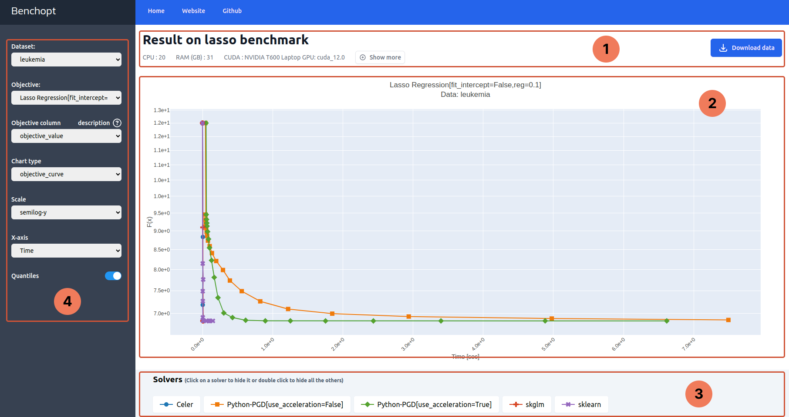

.. _visualize_benchmark:

Visualize a benchmark
=====================

After running a benchmark, benchopt automatically displays the results in an HTML dashboard.
Let's explore the dashboard features on the Lasso benchmark.

.. Hint::

    Head to :ref:`get_started` to first install benchopt
    and setup the Lasso benchmark.

Part 1: Header
--------------

Part 1 contains the benchmark metadata: the benchmark title and the specifications of the machine used to run it.
On the right hand side is a :kbd:`Download` button to download the results of the benchmark as ``.parquet`` file.

Part 2: Figure
--------------

Part 2 is the main figure that plots the tracked metrics throughout the benchmark run.
Its title shows the objective and the dataset names and their corresponding parameters that produced the plot.

Hovering over the figure will make a modebar appear in the right side.
This can be used to interact with the figure, e.g. zoom in and out on particular regions of the plot.

Part 3: Legend
--------------

The legend maps every curve to a solver.

Clicking on a legend item hides/shows its corresponding curve.
Similarly, double-clicking on a legend item hides/shows all other curves.
Finally, hovering over a legend item shows a tooltip with details about the solver.

.. note::

    The displayed details about the solver are the content of the solver's docstring, if present.

Part 4: Sidebar
---------------

The first two dropdown menus, **Data** and **Objective**, enable to select a benchmark setup.
The **Data** dropdown contains all the datasets included in the benchmark as well as their parameters.
The same as for **Objective** dropdown.

The **Objective column** exposes all the tracked metrics along the benchmark run.
These metrics are the ones defined in the ``Objective`` and correspond to the quantities returned by ``Objective.evaluate_result``.

Hovering over the question mark shows a tooltip with details about the objective. Like solver, the details are the content of the ``Objective`` docstring.

The **Chart type** dropdown allows applying transformations to the plotted metric, such as suboptimality ``metric - min(metric)`` or
relative suboptimality ``(metric - min(metric)) / (metric[0] - min(metric))``. It also allows to show bar charts or boxplots.

.. list-table::
   :widths: auto
   :header-rows: 0
   :align: center

   * - .. image:: ../_static/barchart.png
         :width: 49%
         :alt: Bar Chart

       .. image:: ../_static/boxplot.png
         :width: 49%
         :alt: Boxplot

.. note::

    For suboptimality plots, ``min(metric)`` is evaluated across all solvers and iterations.
    If no solver converged, it does not represent the minimal value reachable.

Use **Scale** to set ``x`` and ``y`` axis scale to linear or logarithmic.

Similarly, use **X-axis** to change the quantity plotted in the x-axis and therefore plot the metric as a function of time, iteration or tolerance.

.. note::

    The availability of *Iteration*, and *Tolerance* in the dropdown menu
    depends on the :ref:`sampling strategy <sampling_strategy>` used for the solvers.
    Also, their interpretation is solver-dependent.

Finally, **Quantiles** is a toggler to show/hide ``95th - 5th`` quantiles when the benchmark was run with several repetitions.
