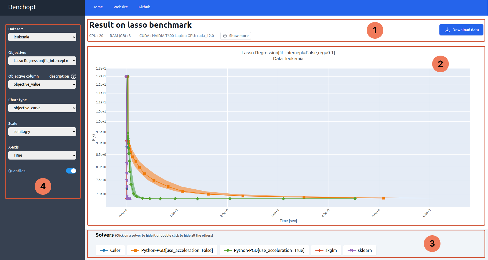

.. _visualize_benchmark:

Visualize benchmark
===================

After running a benchmark, benchopt build automatically a dashboard
to display the output of the benchmark. The dashboard is in ``HTML`` format
so that it can be easily shared.

Let's explore the dashboard features on Benchmark Lasso.
Beforehand, make sure that benchopt is well installed
and the Lasso benchmark is well set up by following the :ref:`get_started`.

Part 1: Header
--------------

This part displays the metadata for the benchmark namely the title of the benchmark
and the specifications of the machine used to run it. On the right hand side,
there is a button :kbd:`Download` to download the output of the benchmark as ``.parquet`` file.

Part 2: Figure
--------------

Here is the main figure that plots the tracked metrics throughout the benchmark run.
It title shows the objective and the dataset names and their corresponding parameters
that produced the plot. Each solver has its own curve.

Part 3: Legend
--------------

This part is a legend that maps every curve to a solver. You can click the legend item to hide/show a it corresponding solver
Similarly, Double-click a legend item to hide/show all the rest solvers.

Also, hovering over a legend item shows a tooltip with details about the solver.

Part 4: Sidebar
---------------

