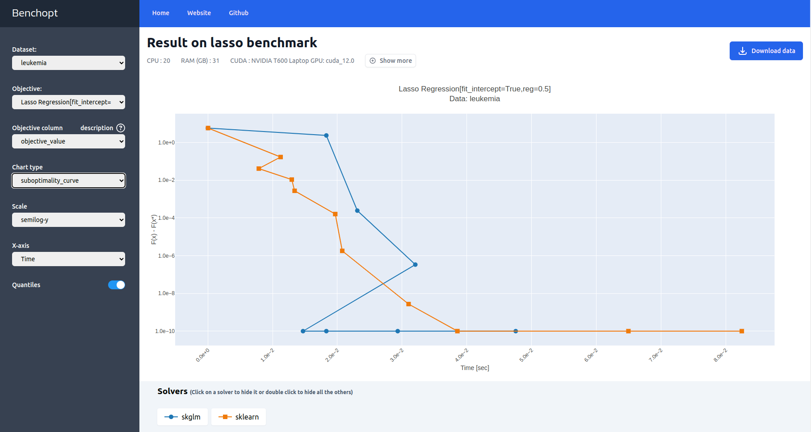

.. _get_started:

Get started
===========

Installation
------------

The recommended way to use benchopt is within a conda environment to fully benefit from all its features.
Hence, start by creating a dedicated conda environment and then activate it.

.. prompt:: bash $

    conda create -n benchopt python
    conda activate benchopt

Benchopt is available on PyPi.
Get the **stable version** via ``pip`` by running:

.. prompt:: bash $

    pip install -U benchopt

This will install the command line tool to run and process the benchmark.

If instead you want to install the **development version**, use

.. prompt:: bash $

    pip install --pre benchopt -U -i https://test.pypi.org/simple

.. attention::

   The **development version** is a work in progress and hence might contain incomplete features.
   A typical user is advised to use the **stable version** instead.

Run an existing benchmark
-------------------------

Let's get the first steps with benchopt by comparing some solvers of the
`Lasso problem <https://en.wikipedia.org/wiki/Lasso_(statistics)>`_ on the
`Leukemia dataset <https://www.science.org/doi/10.1126/science.286.5439.531>`_.

Start by cloning the Lasso benchmark repository and ``cd`` into it.

.. prompt:: bash $

    git clone https://github.com/benchopt/benchmark_lasso.git
    cd benchmark_lasso

Then, use benchopt to install the requirements for the solvers `skglm <https://contrib.scikit-learn.org/skglm/>`_,
`scikit-learn <https://scikit-learn.org/stable/>`_, and the dataset Leukemia.

.. prompt:: bash $

    benchopt install -s skglm -s sklearn -d leukemia

Finally, run the benchmark:

.. prompt:: bash $

    benchopt run . -s skglm -s sklearn -d leukemia

.. note::

    To explore all benchopt CLI features, refer to :ref:`cli_ref`
    or run ``benchopt --help`` or ``benchopt COMMAND_NAME --help``.

When the run is finished, benchopt automatically opens a window in your default browser and renders the results as a dashboard.

The dashboard displays benchmark-defined metrics tracked throughout the benchmark run such as the evolution of the objective value over time.

What's next?
------------

After this glimpse of benchopt, explore more advanced topics such as writing your own benchmark, modifying an existing one, and customizing the benchmark's run options.
