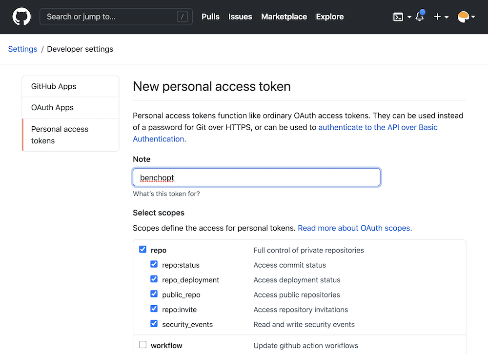

.. _publish_doc:

Publish benchmark results
=========================

BenchOpt allows you to publish your benchmark results to
the `BenchOpt Benchmarks website <https://benchopt.github.io/results/>`_
with one command ``benchopt publish``.

The ``publish`` command will send your results to GitHub by opening
a pull-request on the `BenchOpt results repository <https://github.com/benchopt/results>`_.
Once the pull-request is merged it will appear automatically online.

Workflow example:

.. code-block::

    $ git clone https://github.com/benchopt/benchmark_logreg_l2
    $ benchopt run ./benchmark_logreg_l2
    $ benchopt publish ./benchmark_logreg_l2 -t <GITHUB_TOKEN>

You see that to publish you need to specify the value of ``<GITHUB_TOKEN>``.
This GitHub access token contains 40 alphanumeric characters that allows GitHub
to identify you and use your account.
After getting your personal token as explained below the last
line will read something like:

.. code-block::

    $ benchopt publish ./benchmark_logreg_l2 -t 1gdgfej73i72if0852a685ejbhb1930ch496cda4

.. warning::

    Your GitHub access token is a sensitive information. Keep it
    secret as it is as powerful as your GitHub password!

Let's now look how to create your personal GitHub token.

Obtaining a GitHub token
------------------------

Visit `https://github.com/settings/tokens <https://github.com/settings/tokens>`_
and click on ``generate new token``.
Then create a token named ``benchopt``, ticking the **repo** box as shown below:

Then click on ``generate token`` and copy this token of 40 characters in a
secure location. Note that the token can be stored in a config file for BenchOpt
using ``benchopt config set github_token <TOKEN>``. More info on config files can
be found in :ref:`config_doc`.
