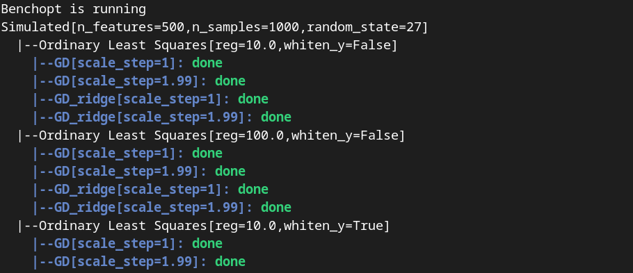

.. _Benchopt: https://benchopt.github.io/#

Understanding and building a simple benchmark with Benchopt
===========================================================

Are you looking for a simple, step-by-step introduction to the `Benchopt`_ library? Then look no further! In this tutorial, we are going to learn how to use the `Benchopt`_ library to compare various algorithms in order to minimize a given cost. This tutorial complements the `write a benchmark <https://benchopt.github.io/how.html>`_ webpage with a more practical, hands-on approach. 

Let's say we want to minimize the cost function of the `ridge regression problem <https://en.wikipedia.org/wiki/Ridge_regression>`_, a variant of linear regression which is a common of supervised machine learning.

.. math::

    f(\beta) = \frac{1}{2} {\|y - X\beta\|}^2 + \lambda{\|\beta\|}^2

where
    - \\(y\\) is a vector with \\(m\\) elements, typically some observations
    - \\(X\\) is a matrix with \\(m \\times n\\) elements, typically the regressors
    - :math:`\beta` is a vector with \\(n\\) elements that we obtain by regressing \\(y\\) on \\(X\\).
    - \\(\\|x\\|\\) is the euclidean norm of \\(x\\).
     

Let us also suppose that we are working with a specific optimization algorithm that aims at solving the ridge regression problem: `the gradient descent (GD) algorithm <https://en.wikipedia.org/wiki/Gradient_descent>`_. GD is a simple algorithm that moves iteratively along the steepest descent direction. Given an estimate :math:`\beta`, GD iterates the following step:

.. math:: 

    \beta \leftarrow \beta - \eta \nabla_{f}(\beta)

where :math:`\eta` is the learning rate or stepsize, and controls how much the unknown is moved alongside the descent direction. Vector :math:`\nabla_{f}(\beta)` is the gradient of the cost function defined above, evaluated at \\(\\beta\\).

Even though GD is a simple algorithm, when applied to our ridge regression problem, we should be mindful of the two hyperparameters: the regularization parameter \\(\\lambda\\), and the gradient stepsize \\( \\eta\\). It is very common in machine learning that we are facing a situation where we want to vary these parameters, and compare the behavior of our algorithm in each scenario. Benchopt we can create a benchmark for this problem, here is a screenshot of what we will get at the end of this tutorial.

.. image:: screenshot_mytemplate_ridgeloss.png
    :width: 800

We can now dive into the framework and see how leverage it to easily create a benchmark!

..
    - It is also fairly common to have to compare several different optimization algorithms to minimize the same cost function. For anyone who has experience in this, performing fair comparisons between various algorithms, which are typically implemented by other people, is quite challenging to do properly. For instance, our implementation of GD may be incorrect. If we trust the algorithm to return a loss function which is computed inside the GD code, it may potentially be artificially small. For instance, when implementing GD, we might mistakingly return as the loss :math:`\frac{1}{2} {\|y - X\beta\|_2}^2 + \frac{1}{2}\lambda{\|\beta\|_2}^2` where the regularization has been wrongly halved. Then this implementation of GD would appear much better, but in fact it is being unfairly compared to competitors and the results reported would be inaccurate.

Installing Benchopt
-------------------

Let's start by installing the benchopt package. It is a python package, so we are assuming that you are starting this tutorial with a functioning python installation, preferably version >=3.10. It is recommanded to run all this tutorial in a dedicated environment (such as a `virtual environment <https://docs.python.org/fr/3/library/venv.html>`_ or a conda environment)

.. 
    , which you can create in an empty repository with the following commands in a linux terminal:

    .. code-block:: bash

        python -m venv benchopt_tutorial_1
        source benchopt_tutorial_1/bin/activate

Benchopt is referenced in the PyPI index, which means it can be installed using ``pip`` by running in a terminal

.. code-block:: bash 

    pip install benchopt

Benchopt and its dependencies are going to be installed, just wait until this is done. If you have any issue with the installation, if you are already in a clean virtual environment, you may have a look at the `installation page <https://benchopt.github.io/#install>`_.

Installing and Running a first benchmark
----------------------------------------

Benchopt in itself is like a mother package: it supervises and runs smaller libraries, a.k.a. the benchmarks.Therefore, benchmarks are repositories with a predefined structure and some required files (we will go over each of them in the next section) that are processed by benchopt. The benchmark specifies information about the problem (typically the loss function to minimize), the dataset on which the algorithms are tested (values of \\(X \\) and \\( y\\)) and the solvers (like our GD algorithm). It is likely that if you are reading this tutorial, you are in fact mostly interested in writing and running a benchmark.

To write a benchmark, it is recommended to start from the template benchmark shared in the Benchopt organisation. To get this template and rename it ``my_benchmark``, you can clone it from its Github repository

.. code-block:: bash 

    git clone git@github.com:benchopt/template_benchmark my_benchmark

The template benchmark is not designed to model our ridge regression problem, but luckily it is pretty close! The cost which is implemented in the template benchmark is the Ordinary Least Squares (OLS)

.. math:: 

    g(\beta) = \frac{1}{2} \|y - X\beta \|^2

and the solver implement is GD with \\(\\nabla_g(\\beta) = -X^Ty + X^TX\\beta \\) the gradient of \\(g\\) at \\(\\beta \\).

We will modify this template to adapt it to the ridge regression problem next, but before that let us run this benchmark. In other words, let us use benchopt to read the contents of the template benchmark and run GD on OLS with a predefined set of stepsizes, in our case \\( [1, 1.99] \\) (the stepsize is scaled with the Lipschitz constant, you can ignore this detail if you are not familiar with this concept).

To run the template benchmark, simply run the following command in the terminal:

.. code-block:: bash

    benchopt run my_benchmark

.. image:: console_template.png
    :width: 600
    :alt: A screenshot of the console during the benchopt run command

You will see something similar to this in your terminal

    - *Simulated* tells us that the dataset run by benchopt is the simulation set up in the benchmark
    - *Ordinary Least Squares* tells us which loss is minimized, and the hyperparameters are written in bracket. 
    - *GD* is a line indicating the progress of algorithm GD for this problem (Simulated dataset, OLS loss). Again its hyperparameters are written in brackets (here the stepsize value).

Once the benchmark has been run, a pop-up window should open in your default navigator. This provides a visualization of the results of the run, which is useful to immediately observe, comment and share the results. After running the template benchmark, we can observe the convergence plots of GD with the two different stepsize choices, for two different simulated dataset. The convergence plots can be made log-log for easier reading. Also, depending on your computer, the runtime is so low that the convergence plot with respect to time is not reliable. We advise to look at the results in terms of iteration (scrolling menu on the bottom left of the webpage). Feel free to play around with the plotting options here! Note that the dataset comes with two values for an option whiten, let us ignore this detail in the tutorial.

Exploring the benchmark structure
---------------------------------

The template benchmark we are using at the moment is not exactly encoding the information we need for the ridge regression problem. To properly modify the benchmark, first we need to dive deeper into how benchmarks work. To follow through this section, it is advised to open an editor (like vscode) in the root of the template benchmark to easily navigate between the files and folders.

Here is the architecture of our template benchmark:

::

    template_benchmark
    ├── datasets          
    │   └── simulated.py
    ├── solvers          
    │   └── python-gd.py
    ├── benchmark_utils          
    │   └── __init__.py
    ├── outputs          
    │   └── ...
    ├── objective.py
    ├── README.rst
    ├── clean_template.py          
    ├── test_config.py          
    └── .gitignore

The three most important files are

    - ``objective.py``: it contains the information about the cost function we want to minimize. In other words, it defines the formal problem we are interested in.
    - ``python-gd.py``: it contains the information and code for the gradient descent solver, dedicated to the problem at hand.
    - ``simulated.py``: it contains the information about the dataset, i.e. the values of \\(y \\) and \\(X \\) used to test the algorithms. All benchmark in fact must have a ``simulated.py`` file which is used for testing by Benchopt.

Any benchmark must implement these three components; in Benchopt indeed we consider that objectives, solvers and dataset are the building blocks of any optimization problem. There can be several solvers in the ``solvers/`` directory, and similarly there can be several datasets in the ``datasets/`` directory. Benchopt will then run all the solvers for each dataset. The other files are not very important right now, let us forget about them.

The content of ``objective.py``, ``solvers`` and ``dataset`` is predetermined. In particular these three files each define a class inherited from Benchopt. The following figure details the methods that must be implemented in each file, and the order in which Benchopt will call these methods:

.. image:: benchopt_schema_dependency.svg
    :width: 800

There are two kind of contents. First, code that defines core elements of the problem:

    - the ``compute`` method in ``objective.py``. It implements the loss function. For the template benchmark, this is exactly \\(g(\\beta) \\) when \\( \\beta \\) is provided as input:
  
    .. code-block:: python

        def compute(self, beta):
            diff = self.y - self.X.dot(beta)
            return dict(
                value=.5 * diff.dot(diff)
            )

    - the ``run`` method in each solver, here ``python-gd``. It defines the steps taken by the algorithm. Benchopt dictates the maximal number of iterations to the solver, and therefore ``run`` takes the number of iterations as input while other parameters like the stepsize are class attributes. The estimate value of \\(\\beta \\) is updated in the class attributes, the ``run`` method does not require returns. For GD, the ``run`` function looks like
  
    .. code-block:: python

        def run(self, n_iter):
            L = np.linalg.norm(self.X, ord=2) ** 2
            alpha = self.scale_step / L
            beta = np.zeros(self.X.shape[1])
            for _ in range(n_iter):
                beta -= alpha * gradient_ols(self.X, self.y, beta)

            self.beta = beta

    - the ``get_data`` method in ``simulated.py`` where \\(y \\) and \\(X \\) are defined. In this template benchmark, they are simply generated randomly using numpy.

    .. code-block:: python

        def get_data(self):
            rng = np.random.RandomState(self.random_state)
            X = rng.randn(self.n_samples, self.n_features)
            y = rng.randn(self.n_samples)
            return dict(X=X, y=y),

The second type of methods found in these three python files are the **communication** tools. Indeed, solvers, dataset and objectives need to exchange information. Typically, the solver needs to know the parameters used for the loss, in our case the value of the regularization parameter. The objective needs to know the values of \\( X\\) and \\( y\\) defined in the dataset. This part of the benchmark can rapidly give you a headache if you are not familiar with the structure of the benchmark, but the figure above should be a good reference point. When a method from a class feeds a method in another class, it returns a dictionary (such as ``get_data`` we just discussed), otherwise it simply updates the class attributes.

.. The previous figure may be updated to detail these communication methods.

Finally, one may wonder where to define the hyperparameters of the problem. The general rule of thumb is that hyperparameters are defined as attributes of solvers, objectives or dataset depending on where it makes the most sense. For instance the stepsize is a solver-dependent parameter, it is defined as an attribute of the ``python-gd`` solver

.. code-block:: python

    class Solver(BaseSolver):
        name="GD"
        parameters = {
            'scale_step': [1, 1.99]
        }

Updating the template to implement a ridge regression benchmark
---------------------------------------------------------------

We are now equipped with enough knowledge to update the template benchmark to a ridge regression benchmark.
Formally, we are starting from OLS and GD implemented for the OLS problem. Therefore we need to implement the following modifications:

    - we should add the regularization term \\( +\\lambda \\|\\beta \\|^2 \\) to the loss in ``objective.py``, and values for the regularization parameter.
    - we should modify the computed gradient, knowing that \\( \\nabla_{f}(\\beta) = \\nabla_{g}(\\beta) + 2\\lambda\\beta \\).

We will not modify anything in the dataset since the inputs \\(X,y \\) of the regression and ridge regression are essentially the same.

Let's start with the ``objective.py`` file. The regularization parameter values are part of the formal definition of the problem, so we can define them as attributes of the ``Objective`` class. The ``whiten_y`` parameter is already implemented, so we can simply add a ``reg`` parameter in the ``parameters`` dictionary.

.. code-block:: python

    class Objective(BaseObjective):
        name = "Ordinary Least Squares"
        parameters = {
            'whiten_y': [False, True],
            'reg': [1e1, 1e2]
        }

This piece of code says that \\( \\lambda\\) should take two values \\( 10\\) or \\( 100\\) across the benchmark.

Then we update the ``compute`` method as follows:

.. code-block:: python

        def compute(self, beta):
            diff = self.y - self.X.dot(beta)
            l2reg = self.reg*np.linalg.norm(beta)**2
            return dict(
                value=.5 * diff.dot(diff) + l2reg,
                ols=.5 * diff.dot(diff),
                penalty=l2reg
            )

We have done several modifications here:

    - The ``l2reg`` variable computes the regularization term. It is added to the OLS term in the ``value`` field of the output dictionary. This ``value`` field is the main loss of the benchmark, used by all algorithms to track convergence.
    - Additional metrics are computes, namely ``ols`` and ``penalty``. Benchmark will compute these metrics alongside the loss function, and we will be able to look at them in the resulting plots.

One additional modification handles the fact that the solvers will require the knowledge of \\(\\lambda\\). The way to communicate from objectives to solvers, according to the figure above, is by using the ``get_objective`` method. It can be modified as follows

.. code-block:: python

        def get_objective(self):
            return dict(
                X=self.X,
                y=self.y,
                reg=self.reg
            )

That's it for the ``objective.py`` file! We can now modify the solver. Instead of modifying directly ``python-gd.py``, let's create a new solver, ``python-gd-ridge.py``. Duplicate the ``python-gd.py`` file and rename it, e.g. using the following command in the ``solvers/`` directory

.. code-block:: bash

    cp python-gd.py python-gd-ridge.py

You should now have a second file in the ``solvers/`` directory. Since Benchopt easily runs several algorithms and compares them natively, we will be able to see if adapting the GD algorithm to the ridge problem is actually useful or not!

Modifying the solver means updating the ``run`` method, more specifically the gradient formula. Inside the ``python-gd-ridge.py`` file, the new ``run`` method looks like this

.. code-block:: python

    def run(self, n_iter):
        L = np.linalg.norm(self.X, ord=2) ** 2
        alpha = self.scale_step / L
        beta = np.zeros(self.X.shape[1])
        for _ in range(n_iter):
            beta -= alpha * (gradient_ols(self.X, self.y, beta) + 2*self.reg*beta)

        self.beta = beta

Note that we are using ``self.reg`` as the value of \\( \\lambda \\). To get this value from the ``objective.py`` file, we need to update the ``set_objective`` method, which is the counterpart of ``get_objective`` we just updated in ``objective.py``.

.. code-block:: python

    def set_objective(self, X, y, reg):
        self.X, self.y, self.reg = X, y, reg

As a final step, we can change the name of our new algorithm to ``"GD-ridge"`` in the class attribute ``name``, to differentiate it from ``"GD"`` in the visualization of the results.

.. code-block:: python

    class Solver(BaseSolver):
        name = 'GD_ridge'

And that's it, you now have your first benchmark setup! Congratulations :)

All that's left is to run the benchmark and look at the results. We run the benchopt with the same command as earlier, in the parent directory of the template benchmark:

.. code-block:: bash

    benchopt run my_benchmark

Notice how the prompt in the terminal now contains logging for the two algorithms ``GD`` and ``GD-ridge``.

Upon completion of the run, you should again have all the results collected in a new interactive window in your default web navigator. There is a lot of interesting information contained in these results. For instance, select the following plotting options:

    - Simulated[n_features=500, n_samples=1000]
    - Ordinary Least Squares[reg=100.0, whiten_y=False]
    - objective_value
    - suboptimality_curve
    - loglog
    - iteration

You should see the following plot 

.. image:: screenshot_mytemplate_ridgeloss.png
    :width: 800

We may observe that the GD-ridge with ``stepsize=1`` reaches a much lower cost value that other methods, in particular GD without the ridge penalisation term. This is expected since GD does not minimizes \\(f(\\beta) \\) but rather  \\( g(\\beta) \\). Interestingly, using ``stepsize=1.99`` leads to large errors. This is caused by the scaling of the stepsize (using the Lipschitz constant) not being updated in our GD-ridge algorithm, and the stepsize is therefore not safe.

One of the interesting features of Benchopt is its ability to easily compute and show several metrics over the run. We have computed the OLS loss \\(g(\\beta) \\) alongside the iterations, and we can observe its values by changing the ``Objective_column`` field to ``ols``. Observe that now GD appears more efficient than GD-ridge. Again this is excepted since GD is designed to minimize the OLS loss.

Concluding remarks
------------------

Thank you for completing this tutorial! Hopefully your understanding of Benchopt benchmark is now sufficient to start your own benchmark. There are a lot of other interesting features to Benchopt, feel free to go over the online documentation to learn more about `Command Line Interface <https://benchopt.github.io/cli.html>`_, `publishing benchmark results <https://benchopt.github.io/publish.html>`_, or `configuring Benchopt <https://benchopt.github.io/config.html>`_.